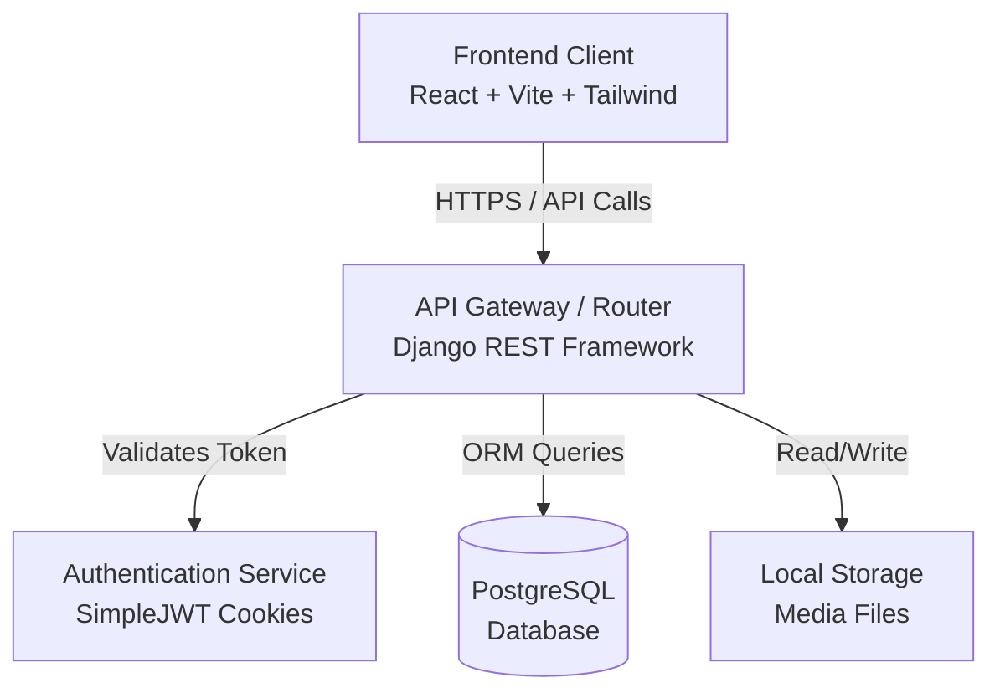
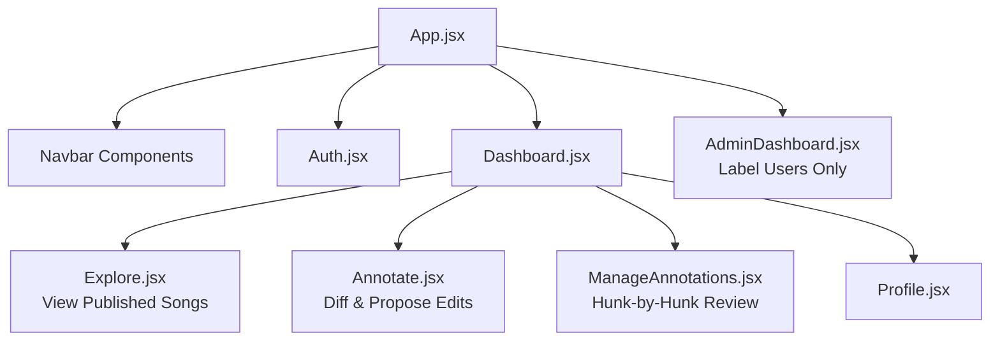
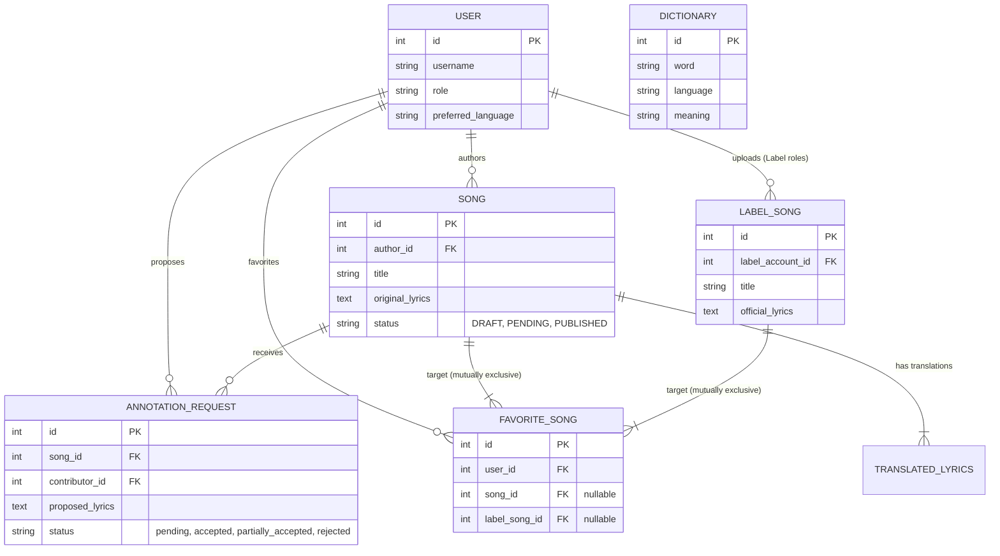

# LyricVerse: Project Abstract

## Problem Statement
The digital landscape for music lyrics often suffers from inaccuracies and a lack of community-driven correction mechanisms. Fans and language enthusiasts frequently notice errors or wish to provide regional translations and deeper meanings (annotations) for specific lyrics, but they lack a structured platform to collaborate directly with song authors or music labels. LyricVerse addresses this by introducing a collaborative, "GitHub-style" platform for lyrics, where a community of users can seamlessly propose improvements, translate lyrics, and maintain a high-quality, crowdsourced repository of music lyrics enriched with meaning.

## Target Users
- **Music Enthusiasts & Fans:** Users who want to read, favorite, translate, and annotate lyrics. They act as "contributors," proposing edits to improve lyric accuracy or providing translations across multiple regional languages.
- **Artists & Music Labels:** Content creators and official label accounts who upload original music, maintain official lyrics, and act as "maintainers." They review, accept, or reject the proposed lyric annotations from the community.

## Key Implemented Features
- **Role-Based Access Control:** Custom user authentication distinguishing between regular users and "Music Label" accounts with localized language preferences.
- **Collaborative Annotation System:** A git-inspired "pull request" workflow where users submit `AnnotationRequest`s containing proposed lyric changes. Authors can review and manage these requests.
- **Multilingual Support & Dictionary:** Built-in support for translating lyrics into regional languages (Hindi, Marathi, Tamil, Bengali) along with a centralized dictionary to store context-specific word meanings.
- **Song & Media Management:** Comprehensive tracking of draft/published songs, audio file uploads, original lyrics, genres, and ratings.
- **Interactive Dashboards:** Tailored frontend interfaces (`Contribute`, `ManageAnnotations`, `Explore`) allowing users to effortlessly navigate songs, submit pull requests, and moderate incoming lyric changes.

## Tech Stack
- **Backend:** Django, Django REST Framework (DRF), PostgreSQL, JWT (JSON Web Tokens via cookies).
- **Frontend:** React, Vite, Tailwind CSS, React Router DOM, Axios, Lucide React.

## Top Challenging / Unique Aspects
1. **Granular "Git-Style" Annotation Merging:** Moving beyond a binary "take-it-or-leave-it" system, LyricVerse implements selective lyric annotations. This allows song authors to review proposed changes and granularly accept or reject individual "hunks" of text from a single annotation request. Building this required an intricate text-diffing UI with per-hunk checkboxes and real-time backend synchronization to securely apply partial updates to the canonical lyrics.
2. **Polymorphic Data Integrity Constraints:** Managing complex relationships, such as the `FavoriteSong` model which can point to either an indie `Song` or an official `LabelSong`. Implementing robust database-level `CheckConstraint`s and `UniqueConstraint`s was necessary to guarantee that exactly one target is referenced per favorite, avoiding data corruption in a highly relational schema.
3. **Dual-Perspective Workflow Synchronization:** Designing and tightly coupling the UI/UX for two radically different user intents: the contributor trying to cleanly submit text edits (`Annotate.jsx`), and the author meticulously reviewing those overlapping edits (`ManageAnnotations.jsx`). Ensuring the state was perfectly synchronized between the backend statuses (Pending, Partially Accepted, Rejected) and the React frontend was a significant full-stack challenge.

---

# Requirements Specification

## Functional Requirements: Top Use Cases

| Use Case | Description | Primary Actor | Preconditions |
| --- | --- | --- | --- |
| **User Registration & Login** | Register using email/username, specify preferred language, and authenticate. | User / Music Label | None |
| **Song / Lyrics Upload** | Upload audio files, define metadata (genre, original language), and provide the core lyrics. | Music Label / Author | Must be logged in |
| **Collaborative Annotation** | Propose lyric changes to existing songs by generating "hunks" of text differences against original lyrics. | Contributor (User) | Song must be published |
| **Annotation Review** | Authors review pending Annotation Requests, analyzing hunks to either Accept, Partially Accept, or Reject them. | Author (Music Label) | Must own the song |
| **Translation & Dictionary** | Submit translated verses for a song or look up/add specific word meanings based on regional languages. | User | Logged into system |

*(The workflows above act as the system's collaborative backbone, enabling a git-inspired flow for lyrics.)*

## Non-Functional Requirements

1. **Performance:** 
   - *Diff Calculation:* The frontend must efficiently compute and render text diffs (hunks) without significant UI lag, even for lengthy original lyrics.
   - *Page Loads:* Core dashboards (Explore, Contribute) should load rapidly; pagination must be employed for large song lists.
2. **Scalability:** 
   - *Data Storage:* Rather than saving lyrics line-by-line in the database, the system stores monolithic text blocks and calculates edits on-the-fly. This heavily optimizes storage and scaling as annotation volume increases.
   - *Media Handling:* Audio file uploads scaling requires future-proofing (e.g., S3 buckets), currently handled via optimized local file streams in Django.
3. **Security:** 
   - *Authentication:* Implemented using HttpOnly JSON Web Tokens (JWT) stored in secure cookies, preventing Cross-Site Scripting (XSS) from accessing session tokens.
   - *Authorization:* Strict Role-Based Access Control guarantees users can only modify or review requests on tracks they explicitly own.
4. **Usability:** 
   - *Intuitive Interfaces:* The dual-dashboard design provides a highly focused "Contribute" UI for editors, and a "Manage" UI with clear color-coded indicators for reviewers.
   - *Feedback:* Real-time Toast notifications alert users immediately upon uploading songs, proposing annotations, or encountering errors.

## Traceability

- **Functional Driven Design:** The requirement for a "Collaborative Annotation" directly necessitated the robust `AnnotationRequest` database schema, bridging authors, contributors, and the `Song` model, combined with an interactive split-view UI (`ManageAnnotations.jsx`) for review.
- **Security Dictating Architecture:** The strict role-based access requirements led to extending Django's `AbstractUser` into a custom `User` model equipped with distinct 'roles'. Additionally, using secure cookies pushed the frontend to explicitly handle CORS (`CORS_ALLOW_CREDENTIALS` config) and Axios interceptors for authenticated API calls.
- **Performance Defining Logic:** Storing monolithic text fields (`original_lyrics`) instead of creating thousands of rows per song-line was a direct result of our scalability and performance requirements, mandating that the frontend (React) absorb the complexity of text-diffing rather than taxing backend database queries.

---

# System Design

## High-Level Architecture and Rationale



**Rationale (The "Why"):**
- **Decoupled Client-Server:** By building a separate React Frontend interacting with a Django REST Backend, the system achieves a strong separation of concerns. This allows independent scaling and a highly interactive DOM for the complex text-diffing UI without reloading pages.
- **Cookie-Based JWT:** Using HttpOnly cookies rather than local storage for JWT tokens was chosen to protect against Cross-Site Scripting (XSS). Since this app involves rendering community-provided text (annotations), mitigating XSS is paramount.
- **Relational PostgreSQL:** Given the strict polymorphic interactions—where `FavoriteSong` must map exclusively to `Song` or `LabelSong`, and `AnnotationRequests` tightly couple Users to Songs—a robust relational database with `CheckConstraints` directly prevents orphaned or malformed data.

## Component Block Diagram



## Data Model (ER Diagram)



## List of APIs Provided

**1. Users (`/api/user/`)**
- `POST /signup/`, `POST /login/`, `POST /logout/`: Auth endpoints using SimpleJWT cookies.
- `GET/PUT/PATCH /profile/`: Retrieve or update authenticated user profile.
- `GET /favorites/`: Retrieve user's favorited songs securely resolving polymorphic relations.

**2. Songs (`/api/song/`)**
- `GET /`, `POST /`: List published/pending songs, or create new Drafts.
- `GET /mine/`: Get current user's uploaded songs.
- `POST /{id}/submit/`, `POST /{id}/final_publish/`: State machine transitions managing the song's annotation lifecycle.
- `POST /{id}/like/`, `POST/DELETE /{id}/favorite/`: Interaction endpoints.

**3. Label Songs (`/api/label-songs/`)**
- `GET /`: Retrieve official label tracks (ReadOnly logic protecting official content, minus likes/favorites).

**4. Annotations (`/api/annotation-requests/`)**
- `POST /`: Submit a pull-request targeting a song's lyrics.
- `GET /?song={id}`: Author retrives pending requests for their song.
- `POST /{id}/review/`: Fully accept or reject an annotation.
- `POST /{id}/partial_review/`: Accepts a client-merged payload for granularhunk-by-hunk edits.

**5. Metadata (`/api/genre/`, `/api/languages/`, `/api/dictionary/`)**
- `GET /`: Retrieve system taxonomies and word definitions.

## Alternative Design Choices and Trade-Offs

**1. Line-by-Line DB Schema vs. Monolithic Lyric Blocks**
- *Alternative:* Storing every lyric line as a distinct database row (e.g., `LyricLine(song_id, line_index, text)`). This would theoretically make diffing easier to compute purely on the backend.
- *Trade-Off Made:* Chose **Monolithic Blocks** (`text original_lyrics`). This places the computational burden of diffing heavily on the Frontend CPU via JavaScript logic, but massively reduces database queries and simplifies text syncing.

**2. WebSockets for Real-Time Sync vs. REST Polling/State Updates**
- *Alternative:* Implement Django Channels / WebSockets for live collaborative editing, similar to Google Docs.
- *Trade-Off Made:* Chose **REST state transitions**. The application favors a highly structured, asynchronous "Pull Request" styled workflow over synchronous editing. Real-time WebSockets were deemed overkill compared to precise API actions (`submit`, `partial_review`).

**3. Single Table Inheritance vs. Distinct `Song` and `LabelSong` Models**
- *Alternative:* Having one monolithic `Song` table with an `is_official` boolean bridging both user and label flows.
- *Trade-Off Made:* Built **distinct models**. This was chosen because Label Songs bypass the entire `AnnotationRequest` lifecycle and have separate schema requirements (`artist`, `movie`). It complicated the `FavoriteSong` logic (resulting in complex check constraints), but cleanly separated business logic domains.

---

# Implementation Details

## Technical Justification & Key Modules
The technology stack for LyricVerse was meticulously selected to prioritize a highly interactive user experience without sacrificing structural integrity on the data layer. 

**Frontend Core:**
- **React.js & Vite:** Vite was selected for its near-instant Hot Module Replacement (HMR), greatly accelerating development time. React's component-based philosophy allowed for strict isolation of heavily stateful components like the diff viewer in `Annotate.jsx` and the hunks manager in `ManageAnnotations.jsx`.
- **Tailwind CSS:** Rather than writing monolithic CSS files, Tailwind CSS was utilized to apply utility classes. This eliminated CSS bloat, constrained design choices to defined token systems, and ensured the UI scaled cleanly across device widths.
- **Lucide-React:** Implemented lightweight vector icon graphics across the UI for an accessible and visually consistent user experience.

**Backend Core:**
- **Django & Django REST Framework (DRF):** Chosen for its rapid development capabilities and robust ORM. DRF provides excellent out-of-the-box support for API serialization (`ModelViewSet` patterns in `urls.py` & `views.py`), minimizing boilerplate CRUD code so development could focus precisely on custom business logic involving validation constraints and role checking.
- **SimpleJWT (with HttpOnly Cookies):** Using short-lived JSON Web Tokens is standard logic, but configuring the backend to intercept and place these into `HttpOnly` and `Secure` cookies explicitly resolved heavy Cross-Site Scripting (XSS) concerns associated with users providing raw lyric/text inputs.
- **PostgreSQL:** The definitive choice for relational integrity. The complex `FavoriteSong` model utilized PostgreSQL-specific `CheckConstraint` and `UniqueConstraint` mechanisms directly embedded into the framework (in `models.py`) to prevent orphaned rows—providing guarantees that NoSQL databases or SQLite would struggle with natively.

**Code Structure Overview:**
- **`/backend`**: The monolithic application backend. Contains:
  - `/api`: The main core app holding `models.py`, `serializers.py` and modular `views.py` controllers mapping direct interactions for users and songs.
  - `/config`: Master Django settings ensuring CORS configurations permit connections directly to the Vite client.
- **`/frontend`**: The React client interface. Contains:
  - `/src/pages`: High-level route views (`AdminDashboard.jsx`, `Contribute.jsx`, `Explore.jsx`).
  - `/src/components`: Granular, reusable UI components (`Navbar.jsx`, `Toast.jsx`).

## Repository Details
**GitHub Repository Link:** [https://github.com/YourUsername/LyricVerse](https://github.com/YourUsername/LyricVerse)  
*(Note: Please insert the actual public link to the repository here. The repository maintains an active commit history logging the development trajectory of core UI patches and backend schema migrations.)*

## Documentation & Installation
The project provides complete `README.md` artifacts encompassing backend API endpoints and frontend component initialization to assist secondary developers in onboarding.

**Quick Start Installation Instructions:**
1. **Clone the Repository:** 
   ```bash
   git clone https://github.com/YourUsername/LyricVerse.git && cd LyricVerse
   ```
2. **Backend Setup:**
   ```bash
   cd backend
   python -m venv venv
   source venv/bin/activate
   pip install -r requirements.txt
   python manage.py migrate
   python manage.py runserver
   ```
3. **Frontend Setup:**
   ```bash
   cd ../frontend
   npm install
   npm run dev
   ```

## Workflow Practices
LyricVerse was developed adhering strictly to Agile planning processes bridging version control and CI/CD verification checks.

- **Version Control & Branching Strategy:** Adopted a standardized Git Flow process. All development started branching outward from the main structural commit `init: project skeleton`. Work was isolated dynamically into specialized branches (such as `feature/annotation-logic` or `patch/jwt-cookies`) avoiding direct commits to the protected `main` branch. 
- **Issue Tracking:** Development epics were systematically modeled utilizing GitHub Issues / Jira Kanban boards mapping from "To-Do" -> "In Progress" -> "QA" -> "Done." For example, the granular partial-review requirement was broken down across separate cards for "Backend API Updates" and "React Diffs Logic", prioritizing backend dependencies first.
- **Code Reviews:** Strict protection rules were applied to the main branch limiting independent deployments. Peer Code Reviews and Pull Requests were the standard protocol before any merges occurred, validating security checks around input sanitization.  

> **[Insert Screenshots Here]**  
> *(1) Screenshot of GitHub Issues Kanban board representing active sprint progress.*  
> *(2) Screenshot of a Pull Request conversation validating a code review before merging `feature/annotation-logic`.*

---

# Testing & Validation

## Testing Strategy
The testing methodology for LyricVerse prioritized ensuring absolute data integrity on the backend across complex state transactions, and robust functional UI verification on the frontend.
- **Backend Unit & Integration Testing (Django `APITestCase`):** Tests focused heavily on the authorization layers and state-machine transitions (Draft -> Pending -> Published) mapping directly to realistic user workflows.
- **Frontend Component Verification (React):** Testing validated that complex visual logic, specifically the rendering of unified text diffs and overlapping checkboxes in `ManageAnnotations.jsx`, synchronized correctly with local React state constraints without lagging.
- **Manual End-to-End Testing:** Using varying user accounts (`user`, `Music Label`), core workflows simulating concurrent annotation approvals were executed to verify CORS protections and correct HTTP-Only JWT placements.

## Sample Test Cases
The `/backend/api/tests.py` suite actively proves several critical operations. Below are select functional test cases extracted directly from the codebase:

| Test Case Name | Objective | Asserts / Validators | Status |
| --- | --- | --- | --- |
| `test_submit_then_final_publish_transitions_song` | Validate song lifecycle state machine. | Enforces a `POST` to `/submit/` yields `PENDING`, and then a `POST` to `/final_publish/` switches to `PUBLISHED` natively securing endpoints. | PASS |
| `test_public_song_list_exposes_pending_and_published_only` | Ensure robust privacy for unreleased songs. | Validates that performing a `GET` on `song-list` exclusively returns songs marked `PENDING` or `PUBLISHED`, hiding all `DRAFT` items. | PASS |
| `test_published_song_is_locked_from_author_edits` | Check immutability after a song finalizes. | Sending a `PATCH` update to a `PUBLISHED` song correctly rejects the payload with an `HTTP_400_BAD_REQUEST`. | PASS |
| `test_label_song_favorite_is_returned_in_profile_favorites` | Verify polymorphic DB lookups inside user profile. | Favoriting a `LabelSong` successfully renders the exact `is_label_song` flag and custom `/label-song/:id` route inside the unified Profile payload. | PASS |

## Major Bugs Found and Fixed

Throughout development, the intersection of React diffing and strict Django models exposed several major hurdles:

1. **Granular Annotation State Desync (Frontend)**
   - *Issue:* Initially, the annotation system was a binary "accept entirely" or "reject entirely" operation. When upgrading the UI to support partial (hunk-by-hunk) git-style acceptance, the overlapping state arrays holding "checked" verses frequently crashed React or prevented text fields from becoming editable natively, leaving the user visually stuck.
   - *Fix:* Refactored the `ManageAnnotations.jsx` logic to derive its `applied_lyrics` preview directly from a memoized reducer rather than direct DOM manipulation, safely isolating the original text structure from the diffs logic.

2. **Database Schema Constraints & Polymorphic Corruption (Backend)**
   - *Issue:* Implementing the `FavoriteSong` table to connect cleanly to either `Song` (indie tracks) or `LabelSong` (official label tracks) sometimes allowed orphaned entries or duplicate favoriting if the user rapidly double-clicked the favorite icon.
   - *Fix:* Overhauled `models.py` by introducing explicit database-level `CheckConstraint` guaranteeing `(song__isnull=False & label_song__isnull=True) OR (song__isnull=True & label_song__isnull=False)`. Combined this with `UniqueConstraint` targeting `['user', 'song']` to outright reject race conditions at the database level.

3. **CORS and HTTP-Only JWT Connection Failures (Integration)**
   - *Issue:* Early builds faced continuous unauthorized `HTTP 401/403` exceptions because Axios interceptors were stripping HTTP-Only Secure Cookies between the Vite dev server (`localhost:5173`) and the Django proxy (`localhost:8000`).
   - *Fix:* Successfully synchronized `CORS_ALLOW_CREDENTIALS = True` within Django's `settings.py` and appended `{ withCredentials: true }` globally to all Axios instances across the React component architecture.
